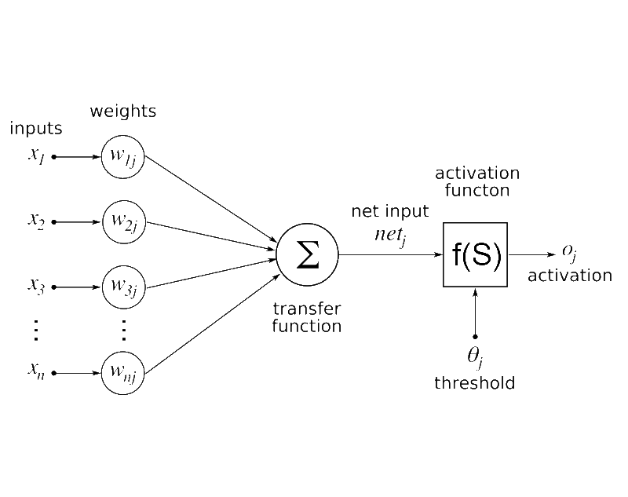
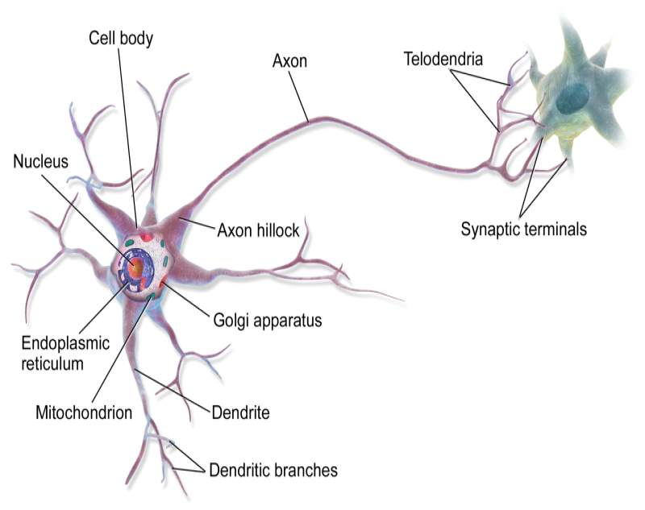

## Neural Network / Artificial Neuron

This project aims to bring together the knowledge and algorithms developed to create an artificial neuron and apply it to the development of a neural network, a project is being developed on campus

Model Artificial Neuron:   

Model Biological Neuron:   

Technologies:   

Basement:   
https://qbi.uq.edu.au/brain-basics/brain/brain-physiology/how-do-neurons-work  
https://drauziovarella.uol.com.br/corpo-humano/neuronio/  
https://www.youtube.com/watch?v=6qS83wD29PY 
https://www.youtube.com/watch?v=HUuUUJktL6E 
https://pt.wikipedia.org/wiki/Neur%C3%B4nio_artificial

Acknowledgement:   
Gedson Faria  
Priscila Martins
